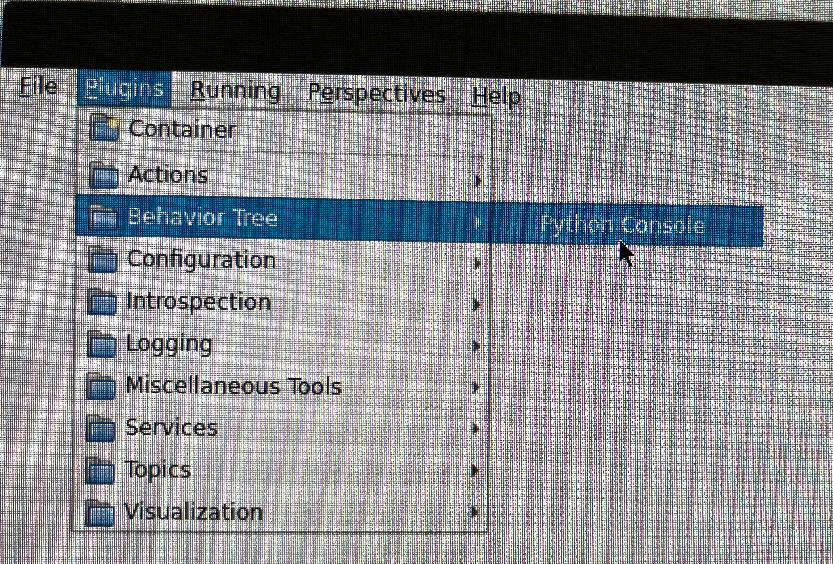
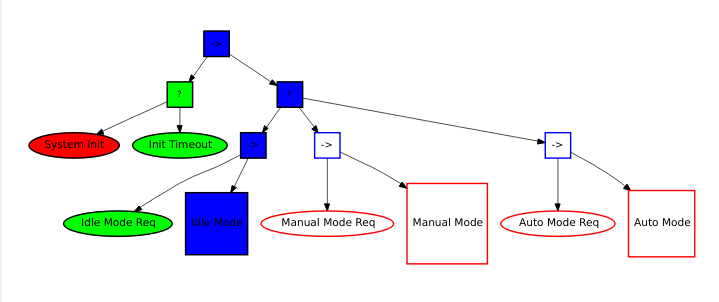
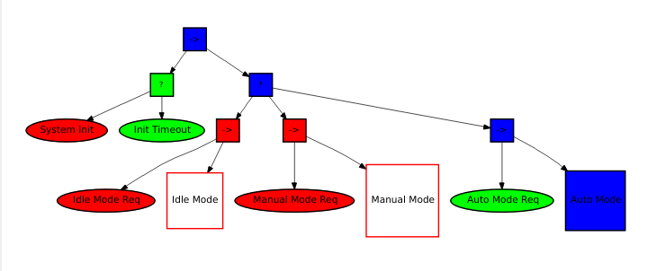

<!-- # Behavior Tree Executive -->
<!--  -->
<!-- This package provides a high-level behavior tree implementation for robotic systems using ROS 2, allowing for state-based control between autonomous, manual, and idle operational modes. -->
<!--  -->
<!-- ## Overview -->
<!--  -->
<!-- The Behavior Executive node manages state transitions between different operational modes: -->
<!-- - **Idle Mode (0)**: Default state before initialization -->
<!-- - **Manual Mode (1)**: Human-operated control -->
<!-- - **Autonomous Mode (2)**: Self-operating control -->
<!--  -->
<!-- The system uses a behavior tree architecture to handle condition checks and actions for mode transitions. -->
<!--  -->
<!-- ## Features -->
<!--  -->
<!-- - System initialization with configurable timeout -->
<!-- - Smooth transitions between operational modes -->
<!-- - State monitoring and publishing -->
<!-- - Visualization support for behavior tree elements -->
<!-- - Configurable topics through ROS parameters -->
<!--  -->
<!-- ## Dependencies -->
<!--  -->
<!-- The following packages are needed by this repository: -->
<!--  -->
<!-- 1. [behavior_tree](https://github.com/strapsai/behavior_tree_ros2) (branch: test/ros-humble) -->
<!-- 2. [behavior_tree_msgs](https://github.com/strapsai/behavior_tree_msgs_ros2) -->
<!-- 3. [rqt_behavior_tree](https://github.com/strapsai/rqt_behavior_tree_ros2) (branch: test/ros-humble) -->
<!--  -->
<!-- ## Installation -->
<!--  -->
<!-- ```bash -->
<!-- # Clone the repository and its dependencies into your ROS 2 workspace -->
<!-- cd ~/ros2_ws/src -->
<!-- git clone git@github.com:strapsai/behavior_tree_ros2 -b test/ros-humble -->
<!-- git clone git@github.com:strapsai/behavior_tree_msgs_ros2 -->
<!-- git clone git@github.com:strapsai/rqt_behavior_tree_ros2.git -b test/ros-humble -->
<!-- git clone git@github.com:strapsai/highlevel_behavior_tree -->
<!--  -->
<!-- # Build the packages -->
<!-- cd ~/ros2_ws -->
<!-- colcon build --symlink-install --packages-select \ -->
<!--   behavior_tree_msgs \ -->
<!--   behavior_tree \ -->
<!--   rqt_behavior_tree \ -->
<!--   highlevel_behavior_tree -->
<!-- colcon build --symlink-install -->
<!--  -->
<!-- # Source the workspace -->
<!-- source ~/ros2_ws/install/setup.bash -->
<!--  -->
<!-- # Refresh the rqt plugins. -->
<!-- rqt --force-discover -->
<!-- ``` -->
<!--  -->
<!-- Double check that the `Behavior Tree` plugin is in the plugin menu. -->
<!--  -->
<!--  -->
<!--  -->
<!-- ## Package Structure -->
<!--  -->
<!-- - **configs/**: Contains behavior tree configuration files -->
<!--   - Definitions for the behavior tree structure in .tree file structure. -->
<!-- - **launch/**: Contains launch files -->
<!--   - `tree.launch.py`: Launches the behavior tree visualization -->
<!--   - `executive.launch.py`: Launches the behavior executive node (this implementation) -->
<!--  -->
<!-- ## Configuration -->
<!--  -->
<!-- The behavior executive can be configured using the following ROS parameters: -->
<!--  -->
<!-- | Parameter | Description | Default | -->
<!-- |-----------|-------------|---------| -->
<!-- | `init_timeout_ms` | Initialization timeout in milliseconds | 5000 | -->
<!-- | `init_topic` | Topic for initialization status | "init_sub" | -->
<!-- | `state_topic` | Topic for state change requests | "state_sub" | -->
<!-- | `current_state_topic` | Topic to publish current state | "current_state_int" | -->
<!-- | `auto_mode_topic` | Topic to publish autonomous mode status | "in_auto_mode" | -->
<!-- | `manual_mode_topic` | Topic to publish manual mode status | "in_manual_mode" | -->
<!--  -->
<!-- ## Usage -->
<!--  -->
<!-- ### Launch the Node -->
<!--  -->
<!-- Take `/spot1/base` as the namespace. -->
<!--  -->
<!-- You can launch the behavior executive node using: -->
<!--  -->
<!-- ```bash -->
<!-- ros2 launch highlevel_behavior_tree behavior_executive.launch.py \ -->
<!--   namespace:=/spot1/base -->
<!-- ``` -->
<!--  -->
<!-- To launch the behavior tree visualization: -->
<!--  -->
<!-- ```bash -->
<!-- ros2 launch highlevel_behavior_tree behavior_tree.launch.py \ -->
<!--   namespace:=/spot1/base -->
<!-- ``` -->
<!--  -->
<!-- To see the visualization in `rqt` on the same machine -->
<!--  -->
<!-- ```bash -->
<!-- ros2 run rqt_gui rqt_gui --ros-args -r __ns:=/spot1/base -->
<!-- ``` -->
<!--  -->
<!-- ### State Transitions -->
<!--  -->
<!-- Also take `/spot1/base` as the namespace. -->
<!--  -->
<!-- The system starts and wait for initialization or the timeout of initialization. Then the system goes in Idle Mode (0). -->
<!--  -->
<!--  -->
<!--  -->
<!-- 1. Send a `true` value to the initialization topic to indicate system readiness: -->
<!--    ```bash -->
<!--    ros2 topic pub /spot1/base/init_sub std_msgs/msg/Bool "data: true" --once -->
<!--    ``` -->
<!--  -->
<!--   For development and debugging purposes, if no initialization signal is received before `Init Timeout` condition turns true, the system considers it has passed the initialization. The default timeout is 5000ms. -->
<!--  -->
<!-- 2. After initialization completes (either by signal or timeout), send a state change request: -->
<!--    ```bash -->
<!--    # For Manual Mode -->
<!--    ros2 topic pub /spot1/base/state_sub std_msgs/msg/UInt8 "data: 1" --once -->
<!--     -->
<!--    # For Autonomous Mode -->
<!--    ros2 topic pub /spot1/base/state_sub std_msgs/msg/UInt8 "data: 2" --once -->
<!--     -->
<!--    # To return to Idle Mode -->
<!--    ros2 topic pub /spot1/base/state_sub std_msgs/msg/UInt8 "data: 0" --once -->
<!--    ``` -->
<!--  -->
<!--    E.g. Auto Mode: -->
<!--  -->
<!--     -->
<!--  -->
<!-- ### Monitoring System State -->
<!--  -->
<!-- Monitor current operational mode: -->
<!-- ```bash -->
<!-- ros2 topic echo /current_state_int -->
<!-- ``` -->
<!--  -->
<!-- Check if system is in autonomous mode: -->
<!-- ```bash -->
<!-- ros2 topic echo /in_auto_mode -->
<!-- ``` -->
<!--  -->
<!-- Check if system is in manual mode: -->
<!-- ```bash -->
<!-- ros2 topic echo /in_manual_mode -->
<!-- ``` -->
<!--  -->
<!-- ## Behavior Tree Structure -->
<!--  -->
<!-- The implementation uses a simple behavior tree structure: -->
<!-- - **Conditions**: System initialization, auto mode request, manual mode request -->
<!-- - **Actions**: Initialization timeout, auto mode, manual mode, idle mode -->
<!--  -->
<!-- The behavior tree configuration files can be found in the `configs/` directory. -->
<!--  -->
